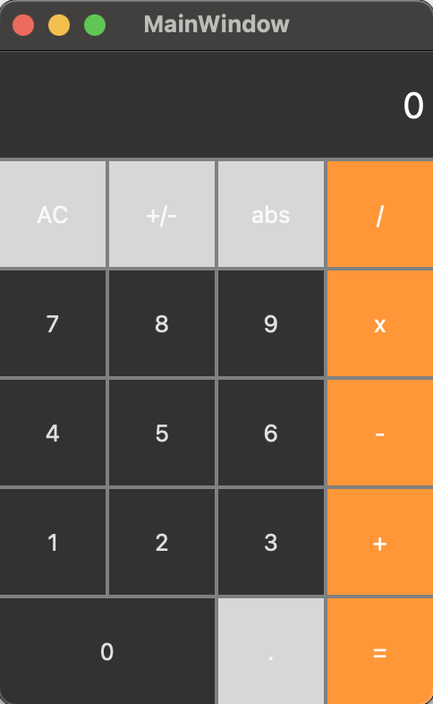

# 🧮 Qt Calculator

Простой графический калькулятор, разработанный на C++ с использованием **Qt Creator**.

## 📋 Возможности

- ➕ Сложение  
- ➖ Вычитание  
- ✖️ Умножение  
- ➗ Деление  
- ♻️ Изменение знака (`+/-`)  
- 🔘 Поддержка десятичной точки  
- || Модуль
- 🧹 Сброс (AC)

## 🖼️ Скриншот

# 🚀 Как собрать и запустить

1. Клонируем проект и открываем его в QT Creator
2. Убедись, что все файлы (mainwindow.cpp, mainwindow.h, mainwindow.ui, main.cpp) находятся в проекте
3. Собираем и запускаем сборку
